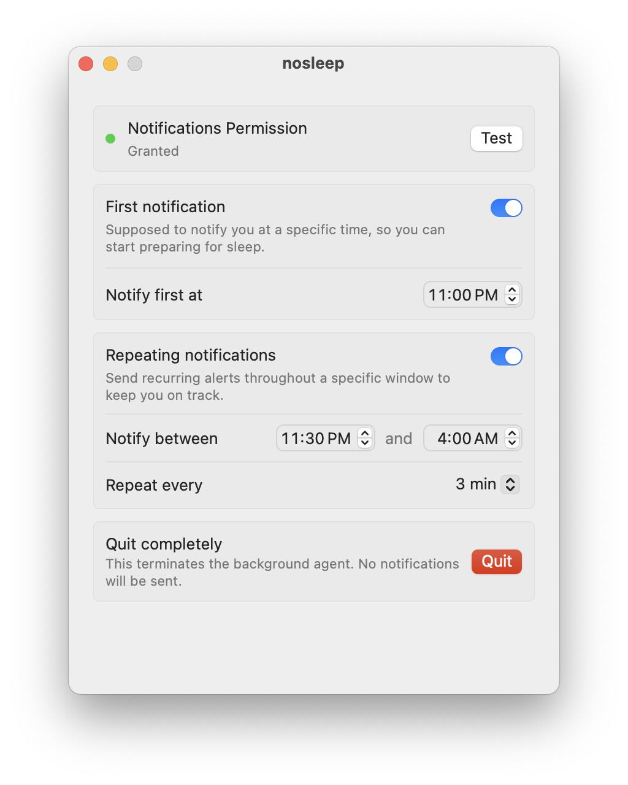

## nosleep

<sup>Swift 6, macOS</sup>

A lightweight macOS utility that sends you local notifications at scheduled times to remind you to shut down your laptop and get some rest ✨

<!-- Theme-aware screenshots (dark/light) -->
<p align="center">
	<picture>
		<source srcset="assets/scr_dark.png" media="(prefers-color-scheme: dark)">
		<source srcset="assets/scr_light.png" media="(prefers-color-scheme: light), (prefers-color-scheme: no-preference)">
		
	</picture>
</p>

### A story

Not sure who'd use this, so here's the origin:

The name comes from either venturing's or TEMPOREX's song "No Sleep", both of which are in Spotify library ❤️. The problem I've experienced so far? Well, there was nothing left to say and I needed to get some rest that day - yes, that's a lyric: 'cause my GPA is higher than the sleep I get each night. And even though I learned my lesson couple lessons ago, the lesson of this story is that no matter what it is - watching YouTube and talking in voice chat, or debugging an app and reading a research paper - it's not okay to stay up until 3 AM.

### Features

It can send you a first notification at a specified time to help you start winding down (e.g., 11 PM). Then it can repeatedly send you notifications between specified times (e.g., 11:30 PM and 4 AM). The app is smart enough to clear notifications when your Mac sleeps and reschedule only future ones when you wake it - so you won't be haunted by a backlog of missed alerts in the morning. The process of getting to bed will be ultimately unforgettable and irreversible (if you dare to open your laptop again).

The app runs quietly in the background - no Dock icon, no menu bar clutter. Close the window or press Cmd + Q to hide it; it stays alive and keeps your reminders scheduled. Double‑click the app again to bring the settings window back. To actually quit it, use button at the bottom of the window.

The app has a great, cutting‑edge, industry‑leading native macOS‑like SwiftUI‑based interface consisting of a 400 px window.

### How notifications work

The app uses a **timer‑based delivery** for repeating reminders, rather than scheduling notifications in advance. This design was chosen after testing two other approaches that proved unreliable in practice.

Previously, the app scheduled the first repeat notification and used the `UNUserNotificationCenterDelegate` methods (`didReceive` and `willPresent`) to schedule the next one each time a notification fired.  

- These delegate methods are **only called when the app is in the foreground** or when the user interacts with a notification.  
- If the app is in the background (which is a main requirement), the notification fires, the system displays it, but **the delegate never runs** - so the chain breaks and no further notifications are scheduled.

**Why not simply schedule them all?**

macOS limits the number of pending notifications per app to 64. If your repeat window spans several hours with a short interval (e.g., 3 minutes), you’d easily exceed that limit - and the system would silently drop notifications.
**Worse, and more importantly**, when your Mac wakes from sleep, all those scheduled notifications that fired while asleep would flood your Notification Center with a useless backlog of missed alerts.

**How the timer approach solves it**

Instead of pre‑scheduling every single notification, the app runs a lightweight background timer (every 30 seconds) that checks the current time against your settings. When it’s time to show a notification, it posts it immediately - only one notification is ever pending at any moment.

So advantages of this approach are:
- **No 64 notification limit** as we never schedule more than one.
- **No backlog on wake** since the timer simply recalculates from the current time and skips any intervals that passed while the Mac was asleep.
- **No missed notifications** as it is solely in the app's charge to send them.

### Development

**Requirements:**

- macOS 14 (Sonoma)
- Xcode CLI (or Xcode)
- Swift 6.2 (or compatible)

**Building an app:**

(You may need to Control‑click the app and select **Open** the first time, if you haven't disabled Gatekeeper - macOS’s usual dance for unsigned apps.)

```bash
git clone https://github.com/futured-it/nosleep.git
# (if GitHub is gonna work any time soon, jkjk)
cd nosleep
./build.sh

# to open: (or as described above)
open nosleep.app
```

### Proposals or ideas

I'm still unsure about when these features are gonna be implemented though:
- Custom notification sounds (e.g. explosions, GPWS sounds, which you can add by wav file)
- Snooze functionality (so that you can disable it for a day or two if needed)
- Android app lmao (I can continue with Instagram reels on my phone)
